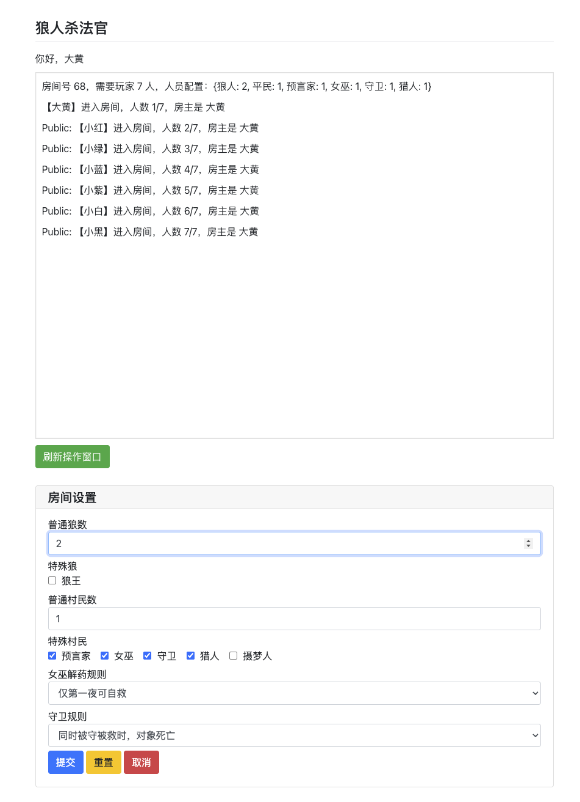

# Wolf
狼人杀面杀法官系统
## 链接
- [狼人杀规则](rules.md)
- [狼人杀角色介绍](roles.md)
- [狼人杀特殊版型介绍](configuration.md)

Preview
--


狼人


女巫


守卫


猎人

如何使用
--
0. 安装 Python 3.7 版本及以上
1. pip install -r requirements.txt
2. python main.py
3. 所有玩家访问 Web 服务

--
使用虚拟环境：
```{
spython3 -m venv venv
source venv/bin/activate
pip install "pywebio==1.8.3"
python main.py
}
```
## 身份介绍
--

- [狼人杀角色介绍](roles.md)

## 待开发和优化
1. TTS 目前仅支持 macOS，windows，需要支持更多的平台
2. 多平台的 Standalone executable
3. 未对断线重连做支持 (等待 PyWebIO 支持)
## 待测试list
- 测试双爆模式跨日竞选逻辑
- 验证警徽移交后新警长权限立即生效
- 检查自曝遗言阶段是否正确触发技能（猎人/狼王）

--

# 程序说明
本项目是一个基于 PyWebIO 的异步狼人杀法官系统，依托 asyncio 驱动协程，分层清晰，便于扩展角色或 UI。

## 1️⃣ 模块分层（2025-11-25 梳理）
- `enums.py`：集中定义枚举（角色、阶段、规则），是所有业务层的基础。
- `models/system.py`：`Global` 负责注册/查询房间与用户；`Config` 存放系统昵称等常量。
- `models/user.py`：封装玩家实体，管理个人状态、消息同步与角色实例（`role_instance`）。
- `models/room.py`：房间核心逻辑，负责角色分配、昼夜循环、投票结算等。
- `models/lobby.py`：大厅 UI 与房间创建/加入流程，包含预设板子、链接跳转等展示逻辑。
- `roles/` 目录：每个角色一个文件，继承 `roles/base.py` 的 `RoleBase`，实现自身技能及 UI。
- `utils.py`：工具函数（随机数、语音播报、网络信息、Scope 命名等），提供跨模块公用能力。
- `main.py`：入口协程，会话生命周期管理、大厅指令分发、房主/玩家输入调度。

模块间依赖链：`enums` → `system` → `room`/`user` → `roles` → `main`，而 `models/lobby` 与 `utils` 为跨层共享组件。

## 2️⃣ 系统运行逻辑
1. **启动阶段**：`python main.py` 会配置 PyWebIO 环境、可选地通过 ngrok 暴露端口，并启动 `start_server`。
2. **用户接入**：玩家输入昵称 → `User.alloc()` 注册 → `defer_call` 保障断线清理。
3. **大厅流程**：
    - `models/lobby.wait_lobby_selection()` 渲染大厅卡片、资料链接。
    - 选择“创建房间”→ `prompt_room_creation()`（支持预设/自定义板子）。
    - 选择“加入房间”→ `prompt_room_join()`（输房号或快速加入按钮，实时刷新房间列表）。
4. **入场与消息区**：进入房间后 `room.add_player(user)`，同步日志到每位用户的 `game_msg`，并在全局 Scope 中挂载倒计时控件。
5. **游戏循环**：
    - 房主操作：开始游戏、公布夜晚信息、发起投票、重新配置房间等。
    - 夜晚阶段：`Room.night_logic()` 依次驱动狼人/女巫/守卫等角色；各角色 UI 由 `role_instance.get_actions()` 返回，配合 `player_action` 装饰器保障阶段校验与确认机制；倒计时/确认逻辑由 `main.py` 调度。
    - 白天阶段：公布夜晚事件、上警/竞选、投票放逐等均在 `room.py` 里结算，`main.py` 负责将操作按钮下发给相应玩家。
6. **胜负判定**：`room.check_game_end()` 在每轮结算后判断狼人/好人阵营是否满足结束条件，触发 `end_game()` 广播、清理状态。

## 3️⃣ 数据流与协作
- **Global Registry**：`Global.rooms` 与 `Global.users` 分别持有房间、玩家实例，提供线程安全的注册/获取。
- **房间 ↔ 玩家**：`Room.players` 保存 `nick → User`，`User.room` 指回当前房间；消息通过 `Room.log` 发布，`User._game_msg_syncer` 异步消费。
- **角色技能**：`user.role_instance` 将具体技能下沉到 `roles/*.py`，夜间行动、确认、倒计时均通过角色实例封装，便于添加新身份。
- **大厅复用**：`models/lobby` 将房间预设、链接区、刷新 UI 等集中管理，`main.py` 只需调用异步接口即可完成大厅体验。

## 4️⃣ 时序概览
```
客户端接入 → main.py 初始化 → models.lobby 渲染大厅/创建房间
  → Room.alloc & User.add_player → Room.start_game
     → Room.night_logic / day phases ↔ roles/* 动作确认
        → Room.check_game_end → end_game → 回到大厅或关闭会话
```
run_async(room.game_loop())：启动游戏循环线程。

游戏循环（room.game_loop()）：
while True：
if not started: sleep。
await night_logic()：夜晚阶段。
await check_game_end()：检查胜负（狼人/好人全灭 → end_game()）。

end_game()：广播结束，清理角色/线程。

夜晚逻辑（room.night_logic()）：
self.round += 1，广播“天黑请闭眼”。
逐阶段（stage = GameStage.WOLF/SEER/...）：
广播“XX请出现”。
self.waiting = True → await wait_for_player()（超时60s）。
玩家行动（通过main的按钮调用User方法，设置status如PENDING_DEAD）。
广播“XX请闭眼”。

结算：
apply_dreamer_logic()：处理摄梦人（免疫/连续死亡，使用utils.rand_int随机）。
统一结算死亡（PENDING_* → DEAD/ALIVE，根据规则如guard_rule）。
广播“天亮请睁眼”，设置stage = GameStage.Day（或第一天SHERIFF）。

第一天：stage = GameStage.SHERIFF（上警，未完整实现）。

白天逻辑：
房主公布death_pending（main中处理）。
投票（host_vote_op → room.vote_kill(nick)）：设置DEAD，检查猎人开枪（未完整）。

消息和广播（room.py）：
broadcast_msg(text, tts)：log.append((SYS_NICK, text))，utils.say(tts)。
send_msg(text, nick)：log.append((nick, text))。
broadcast_log_ctrl(ctrl)：log.append((None, ctrl))，如RemoveInput取消输入。


玩家逻辑（user.py）

创建/注销：alloc/free，使用Global.users。
消息同步（_game_msg_syncer）：run_async循环，读取room.log → append到game_msg（私聊/公聊区分）。
行动方法（@player_action装饰）：
检查room.waiting和should_act()（根据stage和role匹配enums）。
示例：wolf_kill_player(nick) → target.status = PENDING_DEAD，room.waiting = False（结束等待）。
返回str（错误消息）或True/None（成功）。

技能检查：如witch_has_heal()、hunter_gun_status()。

全局和枚举（system.py 和 enums.py）

system.Global：静态方法如reg_room(room)（分配ID）、get_room(id)。
enums：提供mapping()和from_option()，用于配置解析（如main的input_group → Role.from_option）。

--
#Update
## v0.6:
User类添加seat属性，在add_player时分配序号如len(self.players)+1

-通用玩家脚本：保留 user.py 中的 User 类作为通用玩家实体。它包含玩家的基本属性（如昵称、房间、状态、技能字典等），以及通用方法（如 send_msg、skip）。User 现在持有两个与角色相关的属性：
role: 仍然是 enums.Role 枚举值（用于快速检查角色类型）。
role_instance: 一个具体角色类的实例（继承自基类 RoleBase），负责处理该角色的特定技能和逻辑。

- 各个有技能玩家的单独脚本：引入一个新目录 roles/，其中：
base.py：定义基类 RoleBase，包含角色通用的方法（如 should_act、activate_skill 等）。所有角色类都继承自它。
每个具体角色有一个单独的文件（如 wolf.py、seer.py 等），定义该角色的类（e.g., class Wolf(RoleBase)）。角色特定的技能方法（如狼人的 kill_player、预言家的 identify_player 等）都移到这些类中。
平民（Citizen）和无技能角色也用一个简单类实现（继承基类，但技能方法为空或简单实现）。

- 技能集中管理：所有与角色相关的技能逻辑都移到对应的角色类中。添加/删除角色只需：
在 roles/ 目录下添加/删除文件和类。
在 enums.py 的 Role 枚举中添加/删除值。
在 room.py 的角色分配逻辑中更新角色类映射（role_classes 字典）。

其他调整：
room.py 中的游戏逻辑（如夜晚阶段）现在通过 user.role_instance 调用具体技能。
main.py 中的输入处理逻辑调整为调用 user.role_instance 的方法。
移除了 user.py 中的具体技能方法（如 wolf_kill_player），改为委托给 role_instance。
装饰器 player_action 移到 roles/base.py 中，作为角色方法的装饰器。
摄梦人逻辑（原 apply_dreamer_logic）移到 roles/dreamer.py 的类方法中。
保持原有文件结构，但新增 roles/ 目录。

- 兼容性：重构后，代码功能保持不变，但更模块化。添加新角色（如“白痴”）只需创建 roles/idiot.py，定义类，实现技能，然后在映射中注册。

## 2025-11-20 Moonlight 分支优化

1. 在游戏开始处添加公共隔断（一行 ======================），然后广播 游戏开始！身份发放中...。
在每晚开始处添加夜数隔断，格式为 ============ 第 n 晚 ============，随后广播 天黑请闭眼。

2. 狼人操作改动（文件 & 要点）：

wolf.py

get_actions:
显示房间中所有玩家（包含狼人自己）。
已出局玩家按钮不可点击并显示为灰色（disabled + color='secondary'）。
使用按钮 dict 支持 color/disabled，若某玩家被一个或多个狼选择，按钮显示为红色（danger）。
在按钮上方显示当前被哪些狼人选中（例如："Bob 被 狼A, 狼B 选择"），用红色文本呈现。
kill_player:
接受 "seat. nick" 格式输入并提取昵称。
支持更改选择：如果狼之前选过别的目标，会把之前的选择移除（安全检查后移除）。
把选择记录到 room.skill['wolf_votes']（字典：target -> list of wolf nicks），并把狼自己的 user.skill['wolf_choice'] 记录为当前选择；设置 acted_this_stage=True。
room.py

3. 倒计时改动 
夜间狼人结算由原来的 wolf_kill set 改成 wolf_votes 映射：
统计每个被选目标的票数，选择票数最多的目标作为今晚唯一的被刀对象；若存在平票则随机从平票中选一位。
将被选中的玩家设为 PENDING_DEAD，并在 public log 中写入提示（非语音）。
清理 wolf_votes 数据与玩家的 wolf_choice 临时字段。
通用：
在 main.py 中添加每位有夜间操作的玩家的 20s 倒计时（每人单独任务），倒计时结束会自动取消当前输入（相当于超时跳过）。
夜间操作界面自动追加 确认 按钮；点击则取消倒计时并调用玩家角色对象的 confirm() 方法（若实现），以提交选择并结束等待。
行为支持：
修改 base.py 中 player_action：新增返回值约定，支持 'PENDING'（暂存选择）与 'CONFIRMED'（最终确认）的语义，只有最终确认/True/None 会结束等待。
将夜间角色的选择改为“暂存 + 确认”模式（示例实现已完成）：
wolf.py：选择暂存为 user.skill['wolf_choice']，confirm() 会把选择登记到 room.skill['wolf_votes']。夜间结算会统计票数并选出最多票目标（平票随机）。
seer.py：选择暂存为 pending_target，confirm() 会最终公布查验结果。
guard.py：选择暂存为 pending_protect，confirm() 生效后设置守护。
dreamer.py：选择暂存为 pending_dream_target，confirm() 生效。
witch.py：解药/毒药选择暂存为 pending_witch_action，confirm() 统一处理 heal/kill。
hunter.py：将开枪入口适配为支持确认（占位式实现，开枪目标逻辑可后续完善）。
其他：调整了若干细节（如安全移除先前狼票、清理倒计时任务等）。

3. 板子预设
 创建房间界面的板子预设

在选择"创建房间"后，会先显示"板子预设"选择界面
提供两个按钮：
"3人测试板子"：自动配置为 1普通狼人 + 1平民 + 1预言家
"自定义配置"：进入原有的详细配置界面
选择预设后直接创建房间，无需手动填写各项设置

4. 房主的房间配置功能

游戏开始前，房主操作界面的按钮从原来的"开始游戏"变为两个按钮：
"开始游戏"：启动游戏
"房间配置"：重新调整房间设置
点击"房间配置"后会弹出配置界面，显示当前配置的默认值（可修改）
保存后会更新房间配置并广播通知所有玩家

## 2025-11-21 优化
1. ✅ 夜晚操作窗口 - 按钮变黄色标记待选
    位置：wolf.py 的 get_actions() 方法
    实现：当玩家点击某个玩家按钮后，该按钮变为黄色（warning），标志进入待选状态
    特性：倒计时未结束前可以随时更换选择，黄色标记会跟随更新
2. ✅ 狼人确认后广播消息
    位置：wolf.py 的 confirm() 方法
    实现：当一个狼人玩家点击"确认"键后，所有狼人玩家都会收到私聊消息："X号玩家选择击杀Y号玩家"
    特殊情况：如果选择"放弃"，则广播："X号玩家选择放弃"
3. ✅ 狼人击杀判断逻辑
    位置：room.py 的 night_logic() 方法
    实现规则：
        a. 如果狼人团队只选择了一个玩家，则该玩家就是今夜被击杀的目标
        b. 如果狼人团队选择了多个玩家，得票最多的玩家是今夜被击杀的目标
        c. 如果出现平票（多个玩家得票相同），系统自动从平票玩家中随机选择
        d. 如果所有狼人都没有选择或点击了"放弃"，则今夜空刀

4. ✅ 狼人出现时发送队友信息
    位置：room.py 的 night_logic() 方法
    实现：在"Public: 狼人请出现"之后，先给所有狼人玩家发送私聊信息
    信息格式："狼人玩家是：1号、3号(狼王)、5号"
    特性：如果有狼王，会特别标注
    5. ✅ 击杀判定后发送结果并延迟闭眼
    位置：room.py 的 night_logic() 方法
    实现：系统判定完今夜击杀玩家后，给所有狼人发送私聊消息
    消息格式：
    有击杀："今夜，狼队选择X号玩家被击杀。"
    空刀："今夜，狼队空刀。"
    时序：发送消息后延迟3秒，再显示"Public: 狼人请闭眼"
    
    修改的文件
        wolf.py

            添加了 Role 枚举导入
            修改了 get_actions() 方法，实现按钮黄色标记
            修改了 confirm() 方法，实现确认后的广播功能
        room.py

            在狼人阶段开始时添加狼队成员信息广播
            优化了狼人击杀判断逻辑，支持单选/多选/平票/空刀所有情况
            在击杀判定后发送结果消息给所有狼人
            调整了时序，在发送结果后延迟3秒再闭眼

5. 预言家选择按键点击后按钮没有变黄色
修复范围：所有夜间神职角色
    预言家 (seer.py)
    守卫 (guard.py)
    摄梦人 (dreamer.py)
    女巫 (witch.py)
实现方式：
    在每个角色的 get_actions() 方法中获取 pending_* 临时选择
    当按钮对应的玩家是当前临时选择时，设置 'color': 'warning' 使按钮变黄
    玩家可以在确认前随时更换选择，黄色标记会实时更新

6. 未行动的狼人没收到击杀结果私聊消息 ✅
修复文件：room.py

问题原因：
原代码在发送击杀结果消息时有条件 u.status == PlayerStatus.ALIVE，这会排除已死亡但仍是狼人的玩家。

修复方案：
移除了状态检查条件，改为只要是狼人角色（Role.WOLF 或 Role.WOLF_KING）就发送消息，无论玩家是否存活或是否已行动。

## 2025-11-21 其他玩家的操作界面优化
1. main.py：
    - 集成新的女巫操作控件：witch_heal_confirm、witch_poison_op、witch_poison_confirm。
    - 将猎人确认操作加入 input_group 的动作处理逻辑，确保每个角色的新 UI 能通过统一的输入组提交。
2.room.py
    修复阶段关闭刷新逻辑：每个玩家的会话现在会正确发送取消事件，避免之前的 Output.send()/coro not found 错误。
    保证夜晚阶段结束后所有玩家的 UI 同步更新。

3. wolf.py
    重构 confirm()：狼人阶段保持等待，直到所有存活的狼人行动或超时。
    使用共享投票映射和 _check_all_wolves_acted() 辅助方法。
    广播逻辑仍发送给所有狼人。

4. seer.py
    优化 identify_player：安全解析 "seat. nick" 格式，确保预选按钮正确触发能力。

5. witch.py
    重建女巫操作 UI，移除 put_html，新增：
    解药提示，带专用确认按钮和自动消息。
    毒药提示，显示所有玩家按钮，支持禁用/自选/死亡状态，红色高亮，取消支持，独立确认按钮。
    新增处理函数：heal_player、select_poison_target、confirm_poison。
    增加状态清理，避免重复提示。

6. guard.py
    重设计 UI：显示所有存活玩家（按座位排序），高亮当前选择，允许守护任意存活玩家。
    修复 "seat. nick" 解析逻辑。
7. hunter.py
    增加显式确认操作，猎人确认身份并结束阶段。
    状态消息现在每晚只发送一次。

## 2025-11-21 补丁更新2
1. wolf.py
    移除了操作列表中的 put_html，将当前投票摘要移到 help_text 中，彻底解决狼人确认时出现的 Output.send() 崩溃问题。
2. witch.py

    重构女巫操作面板，仅使用 actions 元素：
    添加解药和毒药的确认消息。
    支持“无操作”处理（通过自定义 skip）。
    确保毒药的取消/确认流程逻辑清晰、无重复提示。

3. guard.py
    重写守卫 UI：
        显示所有存活玩家。
        添加确认/跳过的私聊消息。
        清理解析和高亮逻辑，保证交互一致性。
4. main.py：已集成女巫和猎人的确认控件，无额外 UI 冗余（猎人保持单一确认按钮）。
5. seer.py：验证预言家仍正常渲染标准按钮，且在移除 put_html 后不再被阻塞。

## 2025-11-22 补丁更新
1. main.py now appends统一的 刷新 按钮到每次 input_group，并在点按后立刻取消倒计时与输入，重新渲染当前阶段，不会误触发其他操作。
2. room.py 引入 _has_active_role()，把被守/被救状态视为仍可行动；夜间角色轮巡改用该判定，确保猎人即使被守卫保护时也会进入“猎人请出现”阶段，能够完成夜晚确认。
3. Fixed the host-action handler in main.py by properly indenting the '公布昨夜信息' branch so the awaited room.publish_night_info() call sits inside the action check. Re-ran python -m py_compile main.py and python -m py_compile models/room.py; both compile successfully now. Next step could be a quick manual run to ensure the refreshed UI flow behaves as expected.

## 2025-11-22 补丁更新2
1. Added a protective try/except around the main loop sleep in main.py so page refreshes cancel/ignore the pending await instead of crashing sessions.
2. Enhanced sheriff signup handling in room.py: zero or all signups now trigger police-badge loss, and a lone signup auto-elects that player without speeches or votes.
3. Adjusted guard.py so guards still choose targets during守救冲突, but no longer receive the conflict-specific private hint (they just see the usual “你守护了…” message).

## 2025-11-23 补丁更新
1. room.py
    当 没有警长存活 时，prompt_sheriff_order() 会随机选择一名存活玩家作为锚点，并随机选择 顺序/逆序，从该锚点开始发言。
    当 有警长存活 时，房间切换到 GameStage.SHERIFF，等待警长选择。如果警长超时，则回退到同样的随机顺序逻辑。
    新增辅助函数：
        _build_queue_from_player()：根据指定玩家构建发言队列。
        _random_queue_without_sheriff()：在无警长情况下生成随机队列。
        force_sheriff_order_random()：强制随机选择顺序。
        set_sheriff_order() 增加 auto 标志，用于区分 手动选择 和 系统自动选择。

2. main.py
警长选择顺序的提示使用 专用 20 秒倒计时，且计时仅针对警长。
倒计时结束后自动调用 force_sheriff_order_random()。
白天状态跟踪确保：
    只有警长能看到 顺序/逆序按钮。
    不再出现额外的“确认”按钮。

3. main.py
主循环顶部的 sleep 现在会吞掉刷新相关的 RuntimeError 和 CancelledError，避免在点击“刷新操作窗口”时（尤其主持人发言期间）导致 PyWebIO 协程崩溃。

4. room.py
警长选择顺序流程广播优化后的提示：
    “放逐发言阶段，请警长选择发言顺序”
    后续：“警长选择顺序/逆序发言，X请发言”
去掉冗余的初始发言公告。
无警长或超时情况仍有合理的自动选择提示。
随机顺序逻辑和倒计时触发的回退使用一致的文本格式，保持统一。

5. 狼队空刀逻辑
    给狼人面板新增可识别的 放弃 按钮，并在 wolf.py 中把它当成一次明确的弃刀操作处理，确保记录被清理且等待状态只在所有狼人决定后才结束。
    新增 _abstain 与覆盖 skip，使倒计时触发的自动跳过同样计入已行动，且只有当全部狼人行动或放弃后才落刀；若最终无投票则夜晚自动判定为空刀。

6. 更新遗言顺序
    Updated models/room.py::start_execution_sequence so if the executed player is a hunter who successfully shoots someone, the遗言队列 includes both the hunter and the victim (hunter first). That way the sequence after the broadcast becomes: hunter skill announcement → hunter发遗言 →被带走的玩家发遗言.

## 2024-11-23 更近补丁2
1. 狼人自曝机制
新增**SheriffBombRule** 枚举，支持单爆吞警徽和双爆吞警徽两种规则（默认双爆）
狼人在以下阶段会显示红色"自曝"按键：
警长竞选发言（包括PK发言）
放逐发言阶段
推迟退水阶段（双爆模式第二次竞选）
自曝后立即结束当前发言、跳过后续发言和投票，该狼人出局并发表遗言
单爆模式下首日任意狼自曝即警徽流失
双爆模式下，首日自曝推迟警长竞选至次日，上警名单保留；10秒退水窗口结束后继续投票；第二天若再有狼自曝则警徽流失
2. 房间配置新增自曝规则
所有房间预设（3人、6人、7人测试板）默认配置为双爆吞警徽
房主可在创建房间和房间配置界面选择规则：
单爆吞警徽
双爆吞警徽（默认）
规则持久化到 Room.sheriff_bomb_rule 字段
3. 警徽移交与撕毁
警长死亡时，在遗言阶段显示专属操作面板：
可选择任意存活玩家移交警徽（按座位号列表）
或选择撕毁警徽（红色按钮）
移交成功后新警长立即生效；撕毁后本局无警长
警长因任何原因死亡（包括自曝）均可使用此功能
4. 推迟的警长竞选
双爆模式首日自曝后，次日自动恢复警长竞选
系统公告："继续未完成的警长竞选"
保留首日上警名单，给予10秒退水时间
退水结束后直接投票，不再重复发言
若退水后只剩一人，自动当选；若无人则警徽流失
5. 状态跟踪与清理
Room 新增字段：
sheriff_bomb_rule: 配置的自曝规则
sheriff_badge_destroyed: 警徽是否已摧毁
pending_day_bombs: 自曝队列（用于跨阶段处理）
sheriff_deferred_active/payload/bomb_count: 推迟竞选跟踪
每日结束时清理相关标记，避免状态污染
警长死亡且未移交时自动清除警长记录
6. 用户界面优化
自曝按键仅在允许时显示（红色、醒目）
警徽移交面板根据实时存活玩家动态生成按钮
推迟竞选退水阶段自动启动10秒倒计时（与其他操作一致）
所有相关操作取消倒计时任务，避免冲突
7. 兼容性与稳定性
所有改动向前兼容现有游戏流程
无 linter 或编译错误（已通过静态检查）
日志系统集成自曝、移交等关键事件广播
退水倒计时与主循环异步协调，不阻塞其他玩家

## 2025-11-23 更新补丁3
- 增加rules.md 介绍游戏规则
- 增加roles.md 介绍角色
- guard.py: 去掉了“守卫无法防御毒药”的早退。现在守卫即便选择了当晚被女巫毒的玩家，操作也会正常记录并提示已守护，但不会改变该玩家的毒杀结局（仍在结算时死亡），满足“可以守但挡不住毒”的要求。
- witch.py: 给确认毒药逻辑引入 Role 判断，一旦目标是猎人就立即把 target.skill['can_shoot'] 置为 False。这样猎人在夜里收到的状态提醒会明确显示“不能开枪”，且遗言阶段也无法进入开枪模式。

## 2025-11-23 更新补丁4
room.py：放宽狼人自曝条件，只要处于警长竞选发言或 PK 发言阶段且仍存活的狼人都能看到“自曝”按钮，不再限制为当前发言人。
room.py：保留先前实现的 10 秒警长投票倒计时（无新增修改，逻辑仍是到时未投票自动记弃票并立即结算）。
room.py：遗言阶段始终广播“等待 X 号发动技能”，即使该玩家没有可发动的被动；他们的操作面板仍只有“放弃”按钮，点击后会立刻推进到遗言或下一阶段。
已更新 witch.py：
    当女巫已经完成毒/解药动作（acted_this_stage=True）时，skip() 会立即返回，不会再发送“今晚，你没有操作”。
    若女巫只是选了目标但尚未确认，skip() 会清除暂存目标；只有在确实没有任何操作并选择放弃或超时时，才会发送“今晚，你没有操作”。

## 2025-11-23 更新补丁5
- Added a new bullet under README.md’s 身份介绍 to describe白痴：日间翻牌免死、必须先处理警徽、后续只能发言不能投票，确保主 README 也反映了最新机制。
- Updated rules.md in three places: expanded警徽规则、规则盲点第 2 条，以及身份规则里的白痴条目，统一强调翻牌后必须立即移交或撕毁警徽且永久失去投票权。
- Updated hunter.py so任何被动带走公告现在统一为“Public: X号玩家被带走”，并改用 room.handle_last_word_skill_kill() 记录击杀结果，保证被带走玩家自动进入后续流程。
- 重构 room.py 的日间放逐流程：start_execution_sequence() 先建立 day_deaths 队列并进入仅技能阶段，handle_last_word_skill_kill() 会把猎人/狼王等被动击杀的目标追加到同一队列。待所有技能结算完成后，_start_day_last_words_speech() 依据该名单开启遗言阶段，遗言顺序即为死亡顺序；阶段收尾时统一把名单上的玩家结算为死亡。
- 扩展 start_last_words() 以支持“只遗言不技能”的模式，并新增 _prompt_current_last_word_speech() helper，让白天技能阶段与遗言阶段完全分离但依旧沿用原有 UI 逻辑。
- Added sheriff-eligibility helpers in room.py so players marked for death overnight still count as contestants. All sheriff-specific flows (record_sheriff_choice, candidate lists, PK speeches) now treat “night pending” players as available until昨夜信息公布完毕. main.py uses the new Room.can_participate_in_sheriff() to render the 上警/退水/投票控件 even if该玩家已在夜里死亡但尚未公布。
- Ensured that if such a pending player当选警长而在公布时阵亡，现有“技能 → 警徽移交 → 遗言”流水线会触发，因为他们被包含在 follow-up 队列里（逻辑已具备，无需额外改动）。
- Fixed猎人开枪后的流程：hunter.py 现在在确认击杀后调用 room.advance_last_words_progress()，避免房间停留在“被带走”广播。被带走的白痴等玩家会获得正常的被动技能/遗言面板。也顺带确保白痴在日间被动阶段会继续进入移交/遗言流程。

## 2025-11-23 更新补丁6
- Added build_js_countdown_html() plus helper utilities in main.py that render the global timer as an inline JavaScript widget. Each time the stage transitions (wolves act, sheriff vote,遗言、警徽、放逐投票等), the server now injects a DOM block with a self-contained setInterval that animates the countdown entirely on the browser side—no more reliance on server-side sleep loops.
- GLOBAL_COUNTDOWN_READY_HTML now clears any existing intervals so the timer can restart cleanly when phases end, and the main loop only re-renders the countdown scope when the phase key actually changes. Idle states reliably show “倒计时：准备中”.
- Removed the async _global_display_countdown coroutine and all related bookkeeping; countdown tasks are now limited to the per-player input scopes, while the shared header timer is purely client-driven.
- Added JS-driven global countdowns for speaking phases: last-word speeches now render a 120 s timer, while exile speeches show 120 s per speaker (150 s when it’s the sheriff during the regular exile round). get_global_countdown_context() now reports these durations with speaker-specific labels so everyone watching the board sees the same ticking clock.
- Expanded the per-player countdown logic in main.py to start timers for exile speeches and to assign context-aware durations (120 s/150 s for speeches, 10 s for skills, 20 s for night actions). When a speech timer expires it auto-calls room.advance_exile_speech(), and cancelling is handled both on timeout and when the speaker clicks “发言完毕”.
- Updated the stage gating so GameStage.EXILE_SPEECH/EXILE_PK_SPEECH count as timed phases, and ensured last-word speech timers also run for 120 s on both the UI scope and the global display.
- All speech phases now follow the requested timing: sheriff竞选和PK发言、放逐及放逐PK发言均注入 120 s 倒计时，白天放逐阶段若轮到警长则自动展示 150 s。get_global_countdown_context()、全局 JS 计时器和玩家私有 _countdown() 均统一使用这些时长，并在超时后自动推进相应发言队列（含警长与放逐发言）。
- 页面标题体验更新：初次打开默认显示 Moon Verdict 狼人杀法官助手，输入昵称后切换为 Moon Verdict： 欢迎<昵称>加入游戏，进入房间后继续沿用现有的动态房间标题逻辑。

## 2025-11-24 更新补丁1
1. witch.py: “不使用毒药” now immediately clears the pending target, marks the night as finished, and notifies the player, so the action window closes cleanly without wasting the poison. Poisoning a hunter still removes their gun, but wolf king poisoning no longer alters can_shoot.
2. room.py: Nightly poison resolution now leaves the wolf king’s can_shoot flag intact, _start_bomb_last_words() keeps the skill prompt enabled so a self-bombing wolf king/hunter can fire, and can_wolf_self_bomb() lets any alive wolf self-bomb during police speeches, PK speeches, exile speeches, and the deferred-withdraw phase. Also added the blocking logic adjustments described above.
3. Overall behavior: Wolf king poisoned overnight still sees “可以开枪”, self-bombing wolf kings can shoot as expected, and all wolves get the 自曝 button wherever the rules require.

## 2025-11-24 更新补丁2
1. Updated room.py so idiot sheriffs now broadcast the generic “请移交警徽”, flipped idiots stay alive, still deliver last words, and lose future voting rights without blocking the day flow. Added a badge-transfer window controller: the phase now always lasts 10 seconds (with a visible countdown) before continuing to the next stage, even if the decision is made immediately or times out automatically.
2. Added wolf self-bomb flexibility (already addressed earlier) and ensured the white-idiot flow integrates cleanly with last-words and badge follow-ups.
3. Fixed the seer’s “放弃” button in seer.py; it now works as a regular action, ends the night turn, and sends the required private message (“今夜，你放弃查验。”).

## 2025-11-24 更新补丁3（摄梦人与夜间 UI 修复）
- roles/guard.py：将“放弃”按钮改为普通选项并直接走 skip 逻辑，确保守卫操作窗口不会被 PyWebIO 的 cancel 事件提前关闭，倒计时结束也能正确落盘。
- roles/dreamer.py：摄梦人面板现在列出所有玩家（自己与死亡目标为灰色不可点），选中后立刻收到“今夜，你选择让 X 号 Y 梦游”的私聊提示；新增 apply_logic 流水，自动处理梦游免疫、连续两晚指定的梦境吞噬，以及摄梦人出局时的连死判定。
- models/room.py：夜间阶段顺序调整为“女巫 → 摄梦人 → 守卫”，并在结算时统一取消 dream_immunity、dream_forced_death 与 dreamer_nick；若猎人/狼王因梦境死亡或连死，会立即失去开枪资格并收到“你无法开枪。”的私聊，同时遗言阶段的“发动技能”按钮默认置灰。
- main.py：遗言操作面板会根据 can_shoot 状态禁用“发动技能”按钮，并阻止猎人或狼王在枪被锁定时进入技能模式，提示玩家只能“放弃”。
- roles.md：在摄梦人条目中补充“不能对自己发动技能”的说明，使规则文档与最新客户端行为一致。

## 2025-11-24 更新补丁4（混血儿角色与第一夜流程）
- enums.py：新增 GameStage.HALF_BLOOD 以及 Role.HALF_BLOOD 选项，并将“混血儿”纳入可选神职列表，方便房间配置直接勾选。
- roles/half_blood.py（新文件）：实现混血儿角色，第一夜最先睁眼，须选择一名血亲；确认后立即绑定阵营，若放弃或超时则系统随机指派，未能选定时默认按好人阵营计。
- models/room.py：在夜晚流程最前插入混血儿阶段并在超时后调用 ensure_choice() 自动落盘；role_classes 注册新角色，胜负结算依据 half_blood_camp 判断其归属，使其在判定屠民/屠狼时跟随血亲阵营。
- main.py：将混血儿阶段加入夜间倒计时/确认逻辑与全局倒计时标签，计时结束会沿用统一的 skip→自动指派流程；私有倒计时也会检测 pending_half_blood_target。
- roles/seer.py：无论混血儿被绑定到哪个阵营，预言家查验始终返回“好人”，符合角色设定。
- roles.md：第三方阵营章节更新混血儿条目，记录“第一夜最先行动、不可选自己、预言家永远验好”的新机制。

## 2025-11-24 更新补丁5（白狼王）
- enums.py：新增 Role.WHITE_WOLF_KING；room 角色映射与房间配置现在支持在板子中直接添加白狼王。
- roles/white_wolf_king.py（新文件）：白狼王继承狼人夜间投票能力，并在发言/退水阶段提供单独面板提前锁定自爆时要带走的目标。
- models/room.py：统一将白狼王计入狼阵营，胜负判定、夜间信息、狼人票数广播等逻辑全部识别该身份；自曝入口会校验“必须不是最后一狼”与“已锁定目标”，并在自曝后立刻调用新增的击杀流程，把选定玩家送入技能/遗言队列。
- roles/wolf.py 与 roles/seer.py：狼人投票广播、查验结果等都把白狼王视为狼人；roles/half_blood.py 也会把认父到白狼王的混血儿划入狼阵营。
- README/roles.md：补充白狼王技能描述与最新限制条件，提醒只能在发言/退水阶段现形，且自曝前需预先在面板选择击杀对象。

## 2025-11-24 更新补丁6（白狼王自曝结算细化）
1. models/room.py：新增 `pending_day_bombs`/`white_wolf_pending_kills` 队列，白狼王自曝会先把目标写入队列并延迟到公告阶段后统一进入遗言流程，避免房主在“昨夜信息”广播前插队、也确保所有被强制带走的玩家先处理被动技能再公布结果。
2. `_start_bomb_last_words()`/`_trigger_pending_day_bomb_flow()` 现在会根据自曝来源自动跳过白狼王本人的遗言、禁止临时发言、并在遗言队列中插入被带走的玩家；日阶段会记录 `pending_announcement_broadcast`，只有当所有炸弹流程结束后才提示“请房主公布昨夜信息”。
3. 夜里若仅有一名玩家死亡，`publish_night_info()` 会改播“昨夜 X 死亡，等待玩家发动技能”，并在猎人/白狼王技能阶段结束后再提示发言，使所有强制死亡都能进入“等待发动技能→遗言”这一完整链路。
4. roles/wolf.py：狼人点击“放弃”或直接确认空刀都会给狼同伴发私聊（如“7 号选择放弃”），便于队友知晓当前进度；自曝/炸弹逻辑依赖所有狼人尽快完成人数确认，该提示可以减少卡夜的情况。

## 2025-11-24 更新补丁7（大厅与房间弹窗体验）
- 大厅界面常驻：输入昵称后会进入固定的“大厅”按钮区，点击“创建房间”或“加入房间”只会弹出小窗口，背景大厅不再被覆盖或闪烁。
- 创建房间弹窗：按照“自定义 / 12人版型 / 开发者测试版型”三段分组呈现预设按钮，右上角支持 ✕ 关闭；选择“手动配置”后仍可进入原有的完整配置表单，取消任一步骤都会返回大厅。
- 加入房间弹窗：房号输入框与“加入房间”按钮同排显示、整体留白更紧凑；下方的“房间信息”列表改为可点击按钮，直接填入房号并尝试加入，同时保留一键刷新以更新房间余量。
- 弹窗均可随时通过 ✕ 关闭并返回大厅，确保玩家误触时不用重新加载页面；加入逻辑也在房间关闭后提示“房间不存在或已关闭”而不是直接报错。

## 2025-11-25 大厅模块拆分与文档同步
1. 将大厅页面、房间预设、外部链接、房间加入等逻辑从 `main.py` 抽离到 `models/lobby.py`，`main.py` 仅负责调用异步接口。
2. `make_scope_name()` 移动到 `utils.py`，方便大厅与其它界面共享统一的 Scope 命名策略。
3. README 重新梳理模块分层与运行流程，突出大厅模块的位置，方便后续维护大厅 UI。