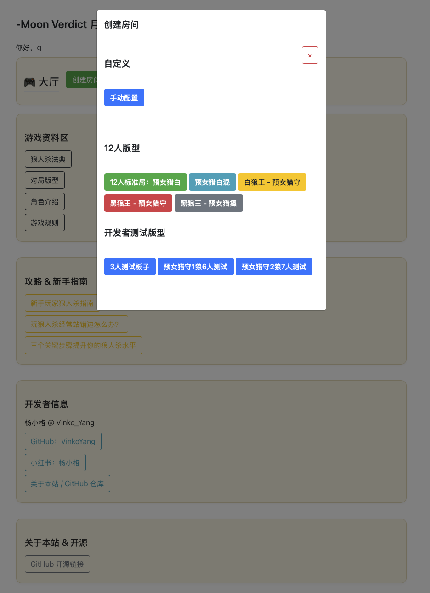
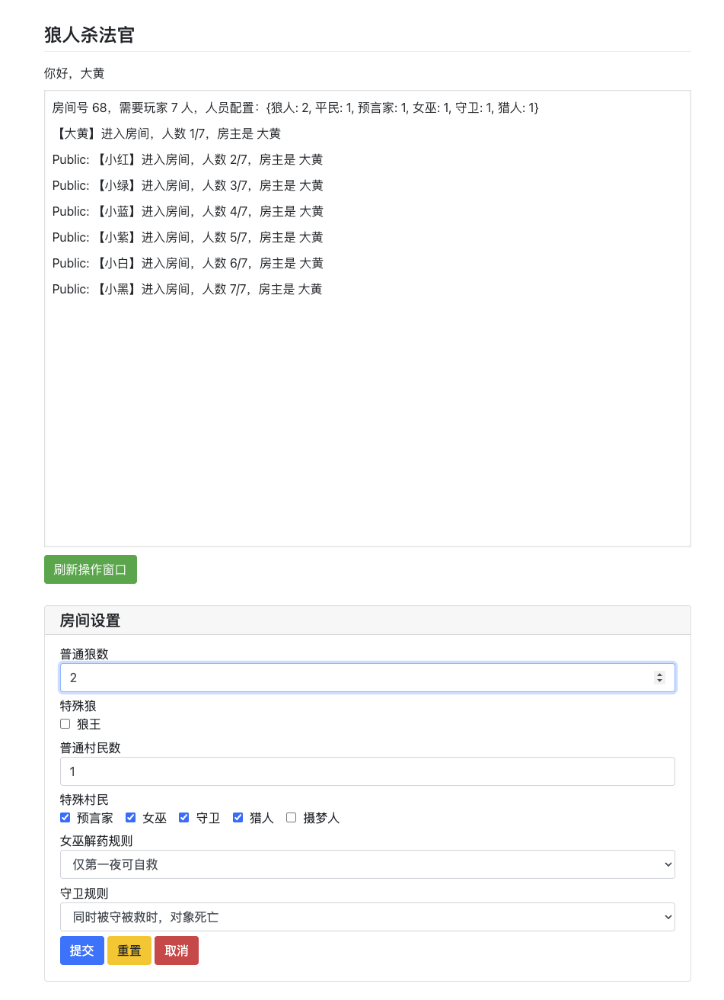
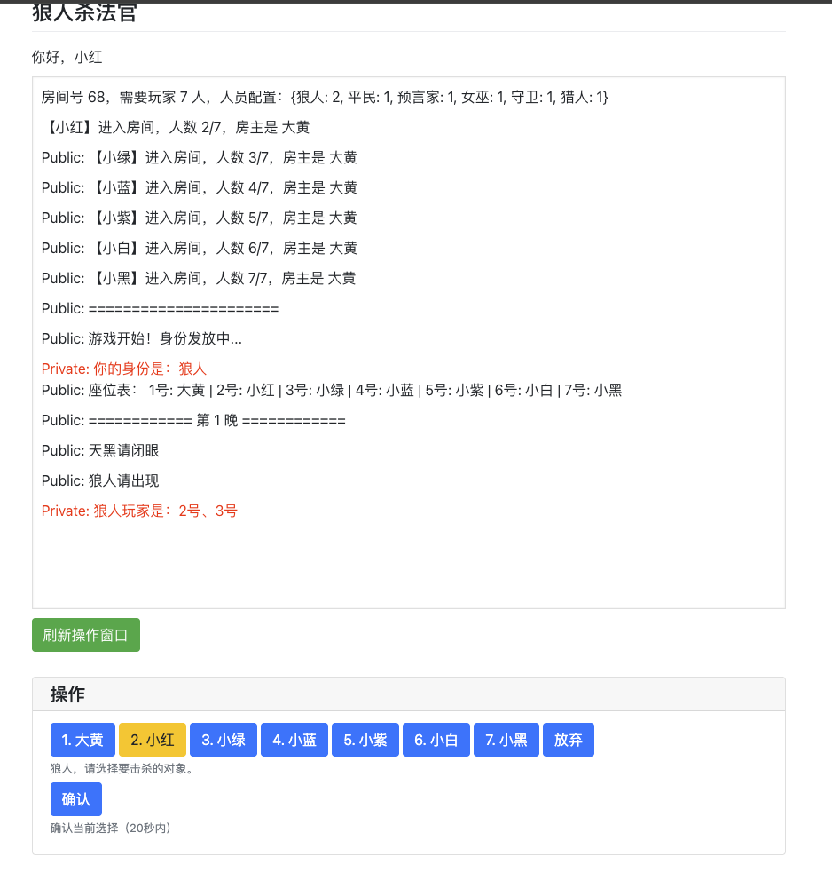
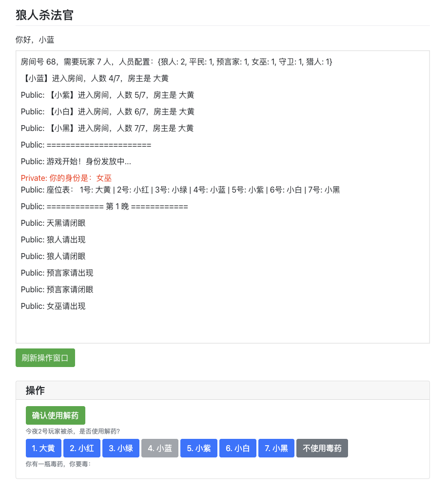
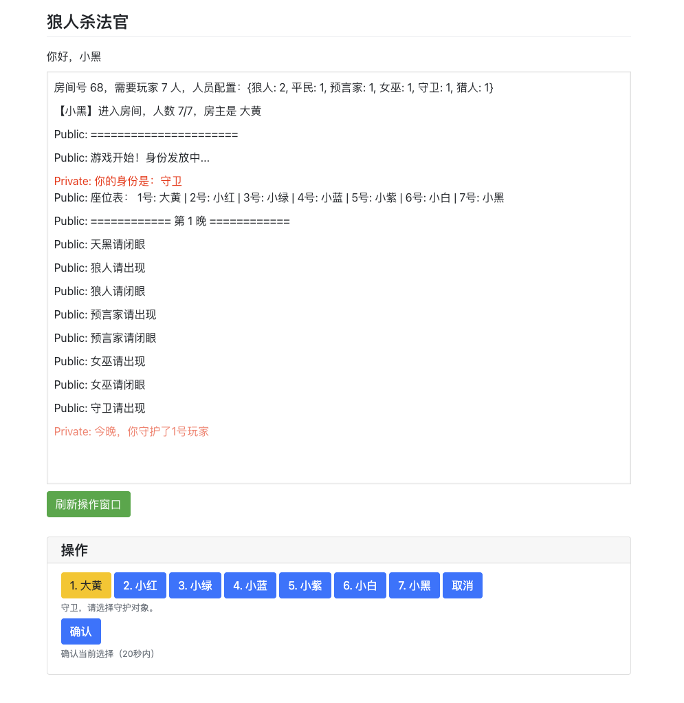
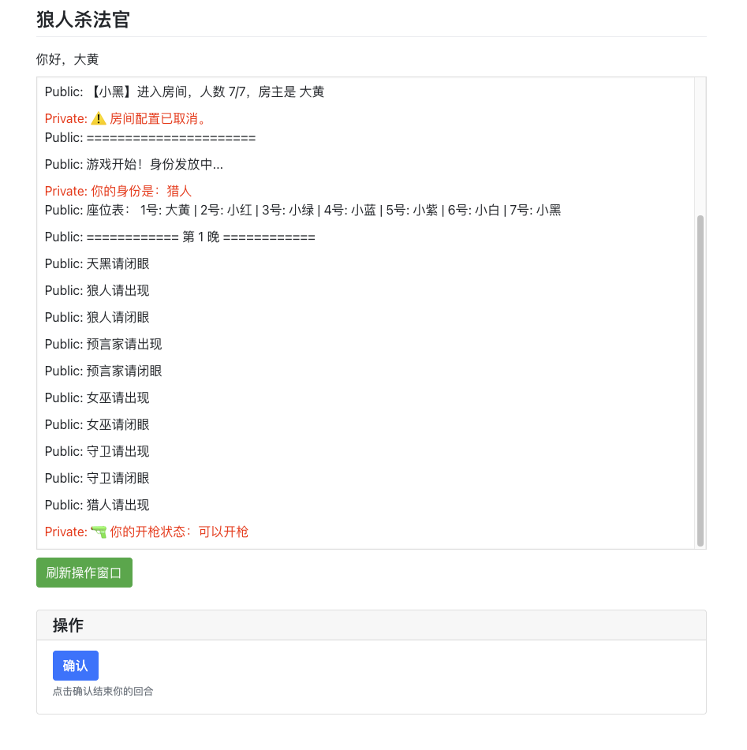

# Wolf — 狼人杀法官助手

基于 **FastAPI + Socket.IO** 的异步狼人杀法官系统。支持断线自动重连，游戏状态持久保存在服务端，刷新页面或后台唤醒后可凭 token 无缝恢复。

## 文档链接
- [狼人杀规则](doc/rules.md)
- [狼人杀角色介绍](doc/roles.md)
- [特殊版型说明](doc/configuration.md)

## 预览





狼人


女巫


守卫


猎人


## 如何使用

0. 安装 Python 3.10 及以上
1. `pip install -r requirements.txt`
2. `python server.py`
3. 所有玩家访问 `http://localhost:8080`

可选：指定端口 + ngrok 公网穿透：
```bash
PORT=8080 NGROK_AUTHTOKEN=你的token python server.py
```

---

## 🧪 Simulation（无服务器测试）

提供两套模拟脚本，**均无需启动 server.py**：

| 脚本 | 测试层 | 用途 |
|------|--------|------|
| `tests/simulate_12p.py` | 直接调用模型方法（绕过 server） | 游戏逻辑回归、边界场景 |
| `tests/simulate_server.py` | 通过 `_dispatch_action` 走按键分发路径 | 验证每个按键从点击到生效的完整链路 |

### 快速启动

```bash
# 游戏逻辑层（快）
python -m tests.simulate_12p --auto

# 按键分发层（验证 server 层按键响应）
python -m tests.simulate_server --auto

# 12人标准局（默认）
python -m tests.simulate_12p --auto

# 指定版型
python -m tests.simulate_12p --preset preset_dev_3  --auto   # 3人
python -m tests.simulate_12p --preset preset_dev_7  --auto   # 7人（含守卫）
python -m tests.simulate_12p --preset preset_standard_12 --auto  # 12人标准

# 不加 --auto 仅发牌查看角色分配，不推进游戏
python -m tests.simulate_12p --preset preset_dev_7
```

### 可用版型（--preset）

| 值 | 描述 |
|----|------|
| `preset_dev_3` | 1狼 + 1平民 + 1预言家 |
| `preset_dev_6` | 1狼 + 1平民 + 预女猎守 |
| `preset_dev_7` | 2狼 + 1平民 + 预女猎守 |
| `preset_standard_12` | 4狼 + 4平民 + 预言家 + 女巫 + 猎人 + 白痴 |
| `preset_half_blood_mix` | 12人混血儿版型 |
| `preset_white_wolf_guard` | 12人白狼王版型 |
| `preset_wolf_king_guard` | 12人黑狼王版型 |
| `preset_wolf_king_dreamer` | 12人黑狼王+摄梦人版型 |
| `preset_nine_tailed_fox` | 12人九尾妖狐版型 |
| `preset_nightmare` | 12人梦魇版型 |
| `preset_wolf_beauty` | 12人狼美人版型 |

### Bot 行为覆盖

| 角色 | 行为 |
|------|------|
| **狼人** | 每人独立随机刀一个非狼存活玩家（不再统一目标） |
| **预言家** | 每夜随机查验一个未查验过的玩家；**固定参与警长竞选** |
| **女巫** | 有解药时救被刀玩家；之后用毒药毒随机剩余存活玩家 |
| **守卫** | 每夜随机守护一人（规避连守规则） |
| **猎人** | 夜晚确认枪状态；被放逐时射杀随机存活玩家 |

白天流程：是否上警随机决定（预言家除外，固定上警）；警长投票各自独立随机选候选人；发言即时推进；放逐投票各自独立随机选候选人；放逐PK同理；遗言立即结束。

### 如何阅读输出

```
[📢]         系统广播（所有玩家可见）
[botX]       私聊消息（仅该玩家可见）
[SYS]        控件日志（如 RemoveInput）
```

关键节点：
- `今夜，狼队选择X号玩家被击杀` → 狼人实际投票落刀，而非空刀
- `今晚，你对X号玩家使用解药 / 毒药` → 女巫两瓶药的使用轨迹
- `你选择查验X号玩家，他的身份是Y` → 预言家每夜查验结果
- `今晚，你守护了X号玩家` → 守卫实际守护
- `X号玩家被带走` → 猎人开枪生效
- 末尾 `[📢] botX：角色名` → 游戏结束身份揭示

### 技术实现

脚本启动时在导入游戏模块前完成以下 monkey-patch：
- `async_sleep` → 最大 0.01 秒（加速所有内置等待）
- `DefaultGameFlow.wait_for_player` → 强制 `min_duration=0`（取消20秒夜间最短等待）

以上 patch 仅在 `--auto` 模式下注入，`run()` 返回后恢复原值，不影响其他进程。

---

## 程序说明

### 1️⃣ 模块分层

- `enums.py`：集中定义枚举（角色、阶段、规则），是所有业务层的基础。
- `models/system.py`：`Global` 负责注册/查询房间与用户；`Config` 存放系统常量。
- `models/user.py`：封装玩家实体，持有 `sid`（当前连接）、`reconnect_token`（断线重连凭据）、`message_cursor`（消息消费位置）与角色实例（`role_instance`）。
- `models/room.py`：房间核心逻辑（建房、分配角色、主持面板），昼夜循环委托给 `RoomRuntimeMixin`。
- `models/room_runtime.py` 与 `models/runtime/`：运行时混入集合（`SheriffFlowMixin`、`DaytimeFlowMixin`、`tools.AsyncTimer` 等），负责警长竞选、白天发言/投票、徽章移交等流程，详见 [`doc/runtime-refactor.md`](doc/runtime-refactor.md)。
- `presets/base.py`：定义 `BaseGameConfig` 与 `DefaultGameFlow`，封装夜晚/胜负流程的策略基类；各特殊版型继承后可独立重写夜晚顺序与胜负判定。
- `presets/game_config_*.py`：各版型独立脚本（`game_config_12p_std.py`、`game_config_wolf_beauty.py` 等），互不依赖，只共享基类。
- `presets/game_config_general.py`：`GeneralGameConfig` — 自定义房型（无特殊版型时）的默认入口，直接复用 `DefaultGameFlow`。
- `presets/game_config_presets.py`：定义 `DEFAULT_ROOM_RULES`（默认女巫/守卫/警长炸弹规则）与所有版型标识常量，供大厅与注册表共用。
- `presets/game_config_registry.py`：集中注册所有版型元数据，供大厅预设模板输出。
- `models/lobby.py`：大厅数据逻辑，包含 `resolve_room_config()`、`build_roles_from_config()` 等纯数据函数，供 `server.py` 调用。
- `roles/`：每个角色一个文件，继承 `roles/base.py` 的 `RoleBase`，实现自身技能及返回 plain dict 的 `get_actions()`。
- `stub.py`：提供 `actions()` / `radio()` 纯函数，返回可直接序列化为 JSON 的 dict。
- `utils.py`：工具函数（随机数、语音播报、网络信息等），`async_sleep()` 直接使用 `asyncio.sleep()`。
- `server.py`：主入口，FastAPI + python-socketio 服务端，含所有事件处理器、行动分发、倒计时任务、状态推送与重连恢复逻辑。
- `static/`：单页前端（`index.html` + `app.js`），含登录/大厅/房间三个视图，Socket.IO 客户端自动重连，凭 localStorage token 恢复游戏状态。

模块间依赖链：`enums` → `system` → `room`/`user` → `roles` → `server`，`models/lobby`、`stub`、`utils` 为跨层共享组件。

### 2️⃣ 预设版型

所有 12 人特殊局已拆分为独立 `game_config_*.py` 脚本，可单独扩展夜晚顺序与胜负判定：

| 文件 | 版型 | 阵容 |
|------|------|------|
| `game_config_12p_std.py` | 12人标准局：预女猎白 | 4狼 / 4村 / 预言家 / 女巫 / 猎人 / 白痴 |
| `game_config_12p_half_blood_mix.py` | 预女猎白混 | 4狼 / 3村 / 混血儿 / 预女猎白 |
| `game_config_white_wolf_guard.py` | 白狼王 - 预女猎守 | 白狼王+3狼 / 4村 / 预言家 / 女巫 / 猎人 / 守卫 |
| `game_config_wolf_king_guard.py` | 黑狼王 - 预女猎守 | 狼王+3狼 / 4村 / 预言家 / 女巫 / 猎人 / 守卫 |
| `game_config_wolf_king_dreamer.py` | 黑狼王 - 预女猎摄 | 狼王+3狼 / 4村 / 预言家 / 女巫 / 猎人 / 摄梦人 |
| `game_config_nine_tailed_fox.py` | 预女猎尾 | 4狼 / 4村 / 预言家 / 女巫 / 猎人 / 九尾妖狐 |
| `game_config_nightmare.py` | 梦魇 - 预女猎守 | 梦魇+3狼 / 4村 / 预言家 / 女巫 / 猎人 / 守卫 |
| `game_config_wolf_beauty.py` | 狼美人 - 预女猎守 | 狼美人+3狼 / 4村 / 预言家 / 女巫 / 猎人 / 守卫 |
| `game_config_mechanical_wolf_mirror.py` | 机械狼 - 镜隐迷踪 | 机械狼+3狼 / 4村 / 通灵师 / 女巫 / 猎人 / 守卫 |

### 3️⃣ 系统运行逻辑

1. **启动**：`python server.py` 启动 FastAPI + Socket.IO 服务，可选通过 ngrok 暴露端口。
2. **用户接入**：浏览器连接 → `login` 事件 → `User.alloc()` 注册并返回 reconnect_token → token 写入 localStorage。断线重连时携带 token，服务端绑定新 sid 并推送当前状态。
3. **大厅**：`get_lobby` 返回房间列表与预设配置；`create_room` / `join_room` 创建或加入房间。
4. **消息区**：进入房间后 `room.add_player(user)`，设置 `message_cursor = len(room.log)`；后续消息通过 `get_pending_messages()` 增量推送。
5. **游戏循环**：
   - 夜晚：`DefaultGameFlow.night_logic()` 依次驱动各角色；`get_actions()` 返回 UI 配置，`player_action` 装饰器保障阶段校验与确认机制；各角色倒计时由 `server.py` 调度。
   - 白天：`DaytimeFlowMixin` / `SheriffFlowMixin` 负责公布夜晚事件、上警/竞选、投票放逐与徽章流程。
6. **胜负判定**：`check_game_end()` 每轮结算后判断是否满足结束条件，触发 `end_game()` 广播并清理状态。

### 4️⃣ 时序概览

```
客户端接入 → server.py login → User.alloc → 返回 reconnect_token
  → get_lobby → create_room/join_room → Room.alloc & User.add_player
    → Room.start_game → night_logic / day phases ↔ roles/* 动作确认
      → check_game_end → end_game → 回到大厅

断线重连：Socket.IO 自动重连 → connect (auth.token) → user.sid = 新sid
  → push_state(user) 推送待收消息 + 当前游戏状态 → 前端恢复房间视图
```

---

## 待开发和优化

1. TTS 目前仅支持 macOS / Windows，需要支持更多平台
2. 多平台 Standalone executable
3. 消息历史（`room.log`）无限增长，超 50000 条时截断，大型游戏可改为 Redis 持久化
4. 多进程部署需配置 `python-socketio` 的 `AsyncRedisManager`，目前适合单进程运行
5. `reconnect_token` 仅做内存校验，服务重启后所有用户需重新登录，可用 signed JWT 实现跨重启持久化


## 开发记录

[开发日志 →](doc/dev_log.md)
